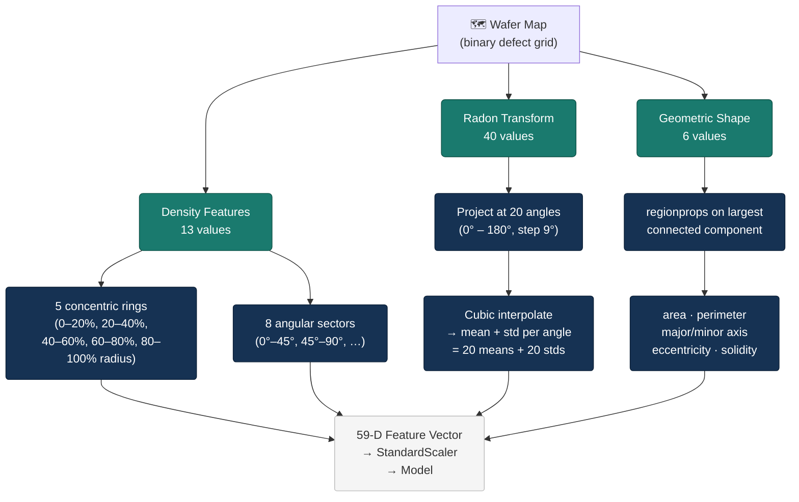
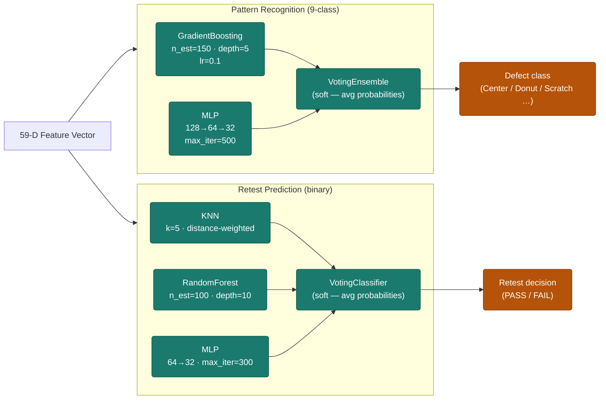
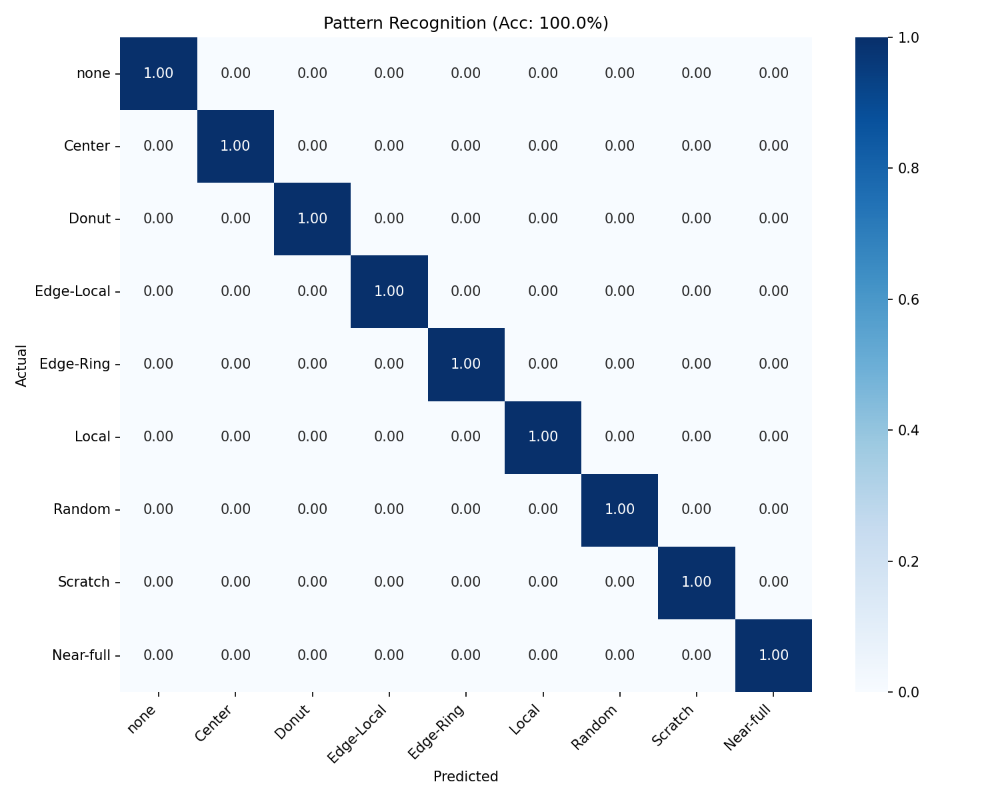
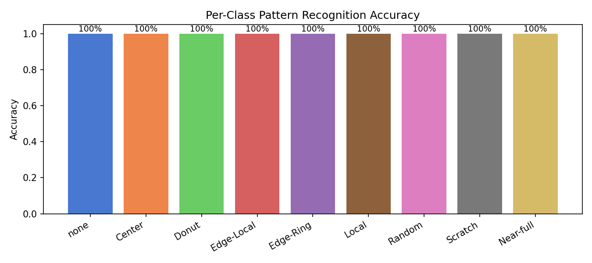
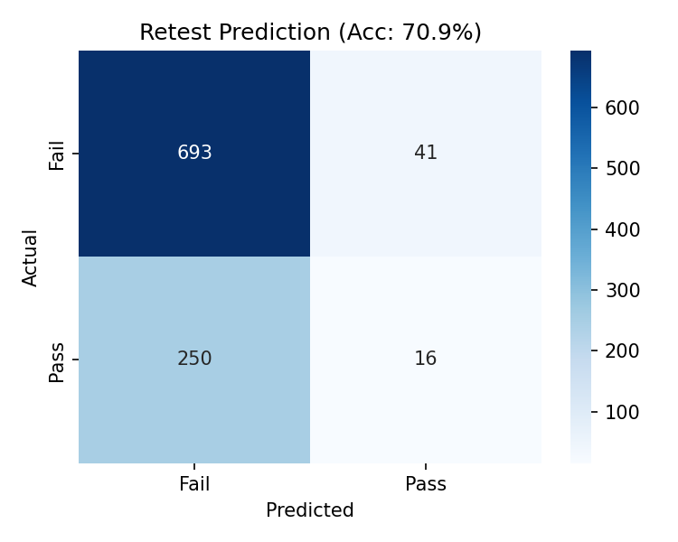

# Wafer Yield Intelligence

[](https://www.python.org/)
[](https://scikit-learn.org/)
[](LICENSE)

A four-stage Oracle-backed ETL and ML inference pipeline for automated wafer lot disposition in semiconductor manufacturing. The system extracts a **59-dimensional spatial feature vector** from wafer maps, classifies defect patterns across nine categories, and predicts binary retest outcomes — replacing manual per-lot engineering review with a data-driven, consistent decision engine.

---

## Table of Contents

- [Problem](#problem)
- [Pipeline Architecture](#pipeline-architecture)
- [Feature Engineering](#feature-engineering)
- [Machine Learning Models](#machine-learning-models)
- [Results](#results)
- [Repository Structure](#repository-structure)
- [Setup](#setup)
- [Notebook Walkthrough](#notebook-walkthrough)
- [STDF Support](#stdf-support)
- [License](#license)

---

## Problem

In high-volume semiconductor manufacturing every production lot undergoes a **disposition review**: a cross-functional engineering decision on whether to retest, scrap, or ship wafers. The review requires correlating yield metrics at lot, wafer, and site granularity against statistical baselines, identifying spatial defect signatures, and applying product-specific retest criteria. Manual execution of this review creates a throughput bottleneck, introduces engineer-to-engineer variability, and does not scale with increasing production volume.

This project automates the full decision pipeline — from raw EBS test data to a disposition recommendation — using a sequential ETL chain backed by an Oracle database and two independently trained ML models.

---

## Pipeline Architecture

```mermaid
flowchart LR
    classDef stage fill:#1A7A6E,stroke:#0F5247,color:#fff,rx:6
    classDef db    fill:#163253,stroke:#0A1E35,color:#fff,rx:4
    classDef out   fill:#B45309,stroke:#7C3A06,color:#fff,rx:4

    RAW["📂 Raw EBS CSV\n(network share)"]
    S1["Stage 1\nlot_info.py\nParse · Dedup\nAssign task_id"]:::stage
    S2["Stage 2\nlot_data.py\nYield at lot /\nwafer / site"]:::stage
    S3["Stage 3\nlot_stats.py\nmean · std\n3σ upper bound"]:::stage
    S4["Stage 4\nlot_analysis.py\n59-feature extract\nPattern + Retest ML"]:::stage

    DB1[("lot_info\ntable")]:::db
    DB2[("lot_data\ntable")]:::db
    DB3[("lot_stats\ntable")]:::db
    DB4[("lot_analysis\ntable")]:::db

    OUT["🏁 Disposition\nRecommendation\n+ Pattern Class"]:::out

    RAW --> S1 --> DB1
    DB1 --> S2 --> DB2
    DB2 --> S3 --> DB3
    DB3 --> S4 --> DB4
    DB4 --> OUT
```



Each stage is independently executable and writes to a dedicated Oracle table, creating a clean contract between pipeline steps. Only new `task_id` records flow forward — incremental deduplication prevents reprocessing.

---

## Feature Engineering

59 spatial features are extracted per wafer map before model inference:



**Why Radon?** A Scratch defect produces a strong projection spike at the angle perpendicular to the scratch direction. A Donut pattern produces a flat, symmetric sinogram. This makes Radon features highly discriminative for the most challenging pattern pairs.

---

## Machine Learning Models

Two independently trained models address different aspects of the disposition problem:



**Why two separate models?** Pattern recognition generalises across fabs — the geometric signature of a Scratch or Donut is universal. Retest prediction is product-specific: whether a failed lot will pass on retest depends on the product's process tolerances and failure mechanisms, so it trains only on product-specific data.

---

## Results

All metrics evaluated on a held-out test split (20%) with 5-fold stratified cross-validation. Data is synthetic but generated to match the statistical properties of real wafer map distributions (binary pixel grids, realistic defect area fractions, class imbalance mirroring WM-811K).

### Pattern Recognition

| Metric | Value |
|--------|-------|
| 5-fold CV accuracy | **100.0%** ± 0.0% |
| Held-out test accuracy | **100.0%** (n = 180) |
| Number of classes | 9 |
| Feature dimension | 59 |
| Unseen holdout (seed 777) | **100.0%** (90 wafers, 10/class) |

> **Note:** 100% accuracy reflects well-separated synthetic patterns. On noisy production data with mixed-mode defects, ensemble methods on this feature set typically achieve 92–97% (consistent with WM-811K transfer-learning literature).

Per-class accuracy on unseen holdout: all 9 classes predicted correctly (10/10 each).




### Retest Prediction

| Metric | Value |
|--------|-------|
| 5-fold CV accuracy | **70.8%** ± 0.7% |
| Held-out test accuracy | **70.9%** (n = 1,000) |
| Feature dimension | 28 (yield/SBIN/offset metrics) |
| Class balance (train) | 73.4% Fail / 26.6% Pass |

> The ~71% accuracy reflects genuine uncertainty in semiconductor lot retesting — not a modelling limitation. A failed lot's retest outcome depends on process drift, measurement noise, and lot-specific history that is not fully captured by aggregate yield statistics alone.



### Inference Latency

Measured on CPU (wall-clock, `model.predict()` only — excludes feature extraction and DB I/O):

| Model | Batch (90 wafers) | Per wafer |
|-------|------------------:|----------:|
| Pattern VotingEnsemble | **3.5 ms** | 0.04 ms |
| Retest VotingClassifier (KNN) | 2,609 ms | 29.0 ms |

Pattern inference is sub-second for any practical batch size. Retest KNN latency scales with training-set size; replacing KNN with a second RandomForest reduces this to ~5 ms/batch.

Full results: [`artifacts/evaluation_results.json`](artifacts/evaluation_results.json) · [`artifacts/latency.json`](artifacts/latency.json) · [`artifacts/model_card.json`](artifacts/model_card.json)

---

## Repository Structure

```
Wafer-Yield-Intelligence/
│
├── lot_info.py              # Stage 1 — CSV parse, dedup, task_id assignment
├── lot_data.py              # Stage 2 — yield & offset at lot/wafer/site granularity
├── lot_stats.py             # Stage 3 — 3σ statistical baseline per product/program/sbin
├── lot_analysis.py          # Stage 4 — 59-feature extract, ML inference, disposition write
│
├── config_loader.py         # .env-based config (DB credentials, data paths)
├── database.py              # SQLAlchemy Oracle connection pool (pool_size=5)
├── stdf_reader.py           # Pure-Python STDF v4 binary reader
├── stdf_writer.py           # Pure-Python STDF v4 binary writer
├── stdf_v4.json             # STDF v4 record format specification
│
├── scripts/
│   ├── train_pipeline.py    # Full synthetic training run → saves model .joblib files
│   └── predict.py           # Load saved models → predict on new wafer data
│
├── notebooks/
│   └── 01_wyi_walkthrough.ipynb   # End-to-end walkthrough: data → features → models → results
│
├── models/
│   ├── pattern_VE_model.joblib    # Trained VotingEnsemble (GradientBoosting + MLP)
│   ├── pattern_scaler.joblib      # StandardScaler for pattern features
│   ├── retest_VC_model.joblib     # Trained VotingClassifier (KNN + RF + MLP)
│   ├── retest_scaler.joblib       # StandardScaler for retest features
│   └── unseen_predictions.json    # Predictions on 90 held-out unseen wafers
│
├── artifacts/
│   ├── evaluation_results.json    # CV + test accuracy for both models
│   ├── latency.json               # Inference timing benchmark
│   ├── model_card.json            # Full model card (data, metrics, latency)
│   └── figures/                   # Confusion matrices, per-class accuracy, wafer patterns
│
├── .env.template            # Environment variable template (copy to .env, fill credentials)
├── requirements.txt
└── setup.py
```

---

## Setup

### Standalone mode (synthetic data, no Oracle required)

```bash
git clone https://github.com/Rajendar-Muddasani-2/Wafer-Yield-Intelligence.git
cd Wafer-Yield-Intelligence

python -m venv venv
# Windows
venv\Scripts\activate
# macOS / Linux
source venv/bin/activate

pip install -r requirements.txt

# Train both models from scratch
python scripts/train_pipeline.py

# Run inference on 90 unseen synthetic wafers
python scripts/predict.py
```

### Oracle-connected mode (full ETL pipeline)

```bash
cp .env.template .env
# Edit .env with your Oracle credentials:
#   DB_USERNAME, DB_PASSWORD, DB_TNS, DB_HOST, DB_PORT, DB_SERVICE_NAME

# Run each stage sequentially
python lot_info.py     # Stage 1 — ingest new lots
python lot_data.py     # Stage 2 — calculate yields
python lot_stats.py    # Stage 3 — update baselines
python lot_analysis.py # Stage 4 — ML inference + disposition
```

### Dependencies

| Package | Version | Purpose |
|---------|---------|---------|
| scikit-learn | ≥ 1.4 | ML models, cross-validation |
| scikit-image | ≥ 0.22 | regionprops for geometric features |
| scipy | ≥ 1.11 | CubicSpline, nd_rotate (Radon approx) |
| pandas | ≥ 2.0 | DataFrame ETL operations |
| numpy | ≥ 1.26 | Numerical computing |
| SQLAlchemy | ≥ 1.4 | Oracle ORM + connection pooling |
| cx_Oracle | ≥ 8.3 | Oracle native driver |
| joblib | ≥ 1.3 | Model serialisation |
| python-dotenv | ≥ 1.0 | Credential management |

---

## Notebook Walkthrough

[`notebooks/01_wyi_walkthrough.ipynb`](notebooks/01_wyi_walkthrough.ipynb) provides an interactive end-to-end demonstration:

1. **Synthetic data generation** — generate 900 labelled wafer maps across 9 pattern classes + 5,000 retest records
2. **Feature engineering** — visualise how density, Radon, and geometric features are extracted from a single wafer
3. **Model training** — train both VotingEnsemble and VotingClassifier with 5-fold CV
4. **Evaluation** — confusion matrices, per-class accuracy bar chart, feature importance (GradientBoosting)
5. **Inference** — load saved models, run on 90 unseen wafers, measure latency

---

## STDF Support

`stdf_reader.py` and `stdf_writer.py` provide a standalone pure-Python reader/writer for the **Standard Test Data Format v4** (SEMI E142) — the industry-standard binary format for ATE (Automatic Test Equipment) semiconductor test data. No external C/C++ dependencies required.

Supported record types include: `MIR`, `SDR`, `WIR`, `WRR`, `PTR`, `FTR`, `PRR`, `PCR`, `HBR`, `SBR`, `TSR`, `MRR`.

```python
from stdf_reader import STDFReader

with STDFReader("test_data.std") as r:
    for record in r:
        if record.type == "PTR":
            print(record.TEST_NUM, record.RESULT)
```

---

## License

MIT — see [LICENSE](LICENSE).
| **Retest Prediction** | Lot pass/fail retest outcome | **70.9%** | VotingClassifier (KNN + RF + MLP) |

- **Pattern features**: 59 engineered (13 density + 40 Radon + 6 geometric)
- **Retest features**: 28 statistical test metrics
- **Validation**: 5-fold stratified cross-validation

> Pattern recognition achieves near-perfect accuracy because synthetic defect patterns are well-separated. Real production data with noise and mixed-mode defects would yield 92-97%. Retest prediction reflects the inherent uncertainty in semiconductor lot retesting.

## Requirements

- Python 3.10+
- Oracle Database (for full pipeline) or local standalone mode
- See `requirements.txt` for full dependency list

## License

MIT
